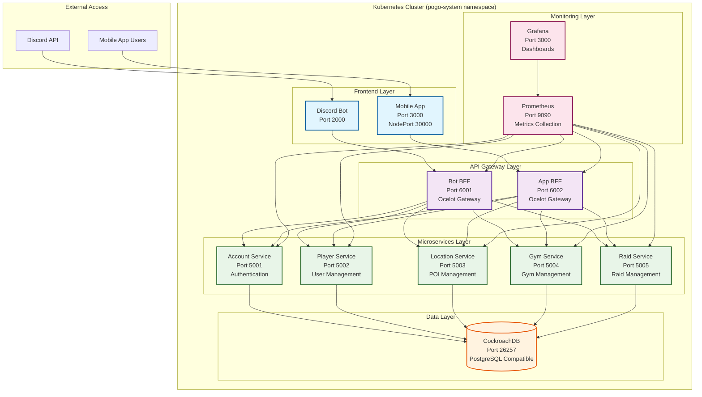

# 🚀 POGO Community - Microservices Architecture

A modern Pokemon GO community ecosystem built with .NET microservices, featuring a Discord bot, React Native mobile app, and comprehensive backend services.

## 🏗️ Architecture Overview

This project has been migrated from a monolithic Node.js API to a modern **microservices architecture** using .NET 10, featuring:

- **5 Microservices** - Each with its own database and domain
- **2 Backend for Frontend (BFF)** services - API gateways for client applications
- **Clean Architecture** - Domain-driven design with CQRS pattern
- **Containerized** - Full Docker support with health checks
- **Scalable** - Independent scaling and deployment

## 🎯 Services

### 🔐 **Account Service** (Port 5001)

- User authentication and account management
- JWT token generation and validation
- Password hashing with BCrypt
- Account creation and login

### 👤 **Player Service** (Port 5002)

- Player profiles and management
- Team assignments (Valor, Mystic, Instinct)
- Friend codes and Discord integration
- Player statistics and levels

### 📍 **Location Service** (Port 5003)

- Geographical locations and POIs
- Spatial search with radius queries
- Address management and geocoding
- Location types (Gym, Pokestop, etc.)

### 🏟️ **Gym Service** (Port 5004)

- Pokemon Gym management
- Team control and motivation tracking
- Gym status and attack monitoring
- Integration with Location service

### ⚔️ **Raid Service** (Port 5005)

- Pokemon Raid management
- Raid scheduling and participation
- Player join/leave functionality
- Integration with Gym and Player services

### 🤖 **Bot BFF** (Port 6001)

- API Gateway for Discord bot
- Ocelot routing and load balancing
- Request aggregation and transformation
- CORS and authentication handling

### 📱 **App BFF** (Port 6002)

- API Gateway for mobile app
- Ocelot routing and load balancing
- Request aggregation and transformation
- CORS and authentication handling

## 🚀 Quick Start

### Prerequisites

- **.NET 9 SDK** - For microservices development
- **Docker & Docker Compose** - For containerization
- **Node.js >= 18.0.0** - For client applications
- **pnpm >= 8.0.0** - Package manager
- **Minikube** - For Kubernetes development (optional)

### Installation

```bash
# Clone the repository
git clone <repository-url>
cd pogo

# Install dependencies
make install
# or
pnpm install
```

### Development

#### Option 1: Full Microservices Stack

```bash
# Start all microservices with Docker Compose
make microservices-start

# Check status
make microservices-status

# View logs
make microservices-logs

# Health check
make microservices-health
```

#### Option 2: Individual Services

```bash
# Build all microservices
make microservices-build

# Run specific services locally (requires databases)
dotnet run --project apps/backend/microservices/Account.Service
dotnet run --project apps/backend/microservices/Player.Service
# ... etc
```

#### Option 3: Client Applications

```bash
# Run Discord bot
make run-bot

# Run mobile app (web)
make run-mobile-web

# Run mobile app (Android)
make run-mobile-android

# Run mobile app (iOS)
make run-mobile-ios
```

## 🛠️ Available Commands

### General Commands

| Command        | Description                      |
| -------------- | -------------------------------- |
| `make help`    | Show all available commands      |
| `make install` | Install all dependencies         |
| `make build`   | Build all applications           |
| `make dev`     | Run all apps in development mode |
| `make test`    | Run all tests                    |
| `make lint`    | Lint all applications            |

### Microservices Commands

| Command                      | Description                         |
| ---------------------------- | ----------------------------------- |
| `make microservices`         | Show microservices help             |
| `make microservices-build`   | Build all microservices and BFFs    |
| `make microservices-start`   | Start all microservices with Docker |
| `make microservices-stop`    | Stop all microservices              |
| `make microservices-restart` | Restart all microservices           |
| `make microservices-logs`    | View logs for all microservices     |
| `make microservices-status`  | Show status of all microservices    |
| `make microservices-health`  | Check health of all microservices   |
| `make microservices-clean`   | Clean up microservices resources    |

### Docker Commands

| Command              | Description                    |
| -------------------- | ------------------------------ |
| `make docker-up`     | Start all services with Docker |
| `make docker-down`   | Stop all services              |
| `make docker-logs`   | View logs for all services     |
| `make docker-status` | Show service status            |

## 📁 Project Structure

```
pogo/
├── apps/
│   ├── backend/
│   │   ├── microservices/           # .NET Microservices
│   │   │   ├── Account.Service/     # User authentication
│   │   │   ├── Player.Service/      # Player management
│   │   │   ├── Location.Service/    # Location management
│   │   │   ├── Gym.Service/         # Gym management
│   │   │   └── Raid.Service/        # Raid management
│   │   └── bffs/                    # Backend for Frontend
│   │       ├── Bot.BFF/             # Discord bot gateway
│   │       └── App.BFF/             # Mobile app gateway
│   └── frontend/
│       ├── bot/                     # Discord bot (Node.js)
│       └── mobile/                  # React Native mobile app
├── packages/
│   ├── dotnet-shared/               # Shared .NET libraries
│   │   ├── Pogo.Shared.Kernel/      # Domain entities and base classes
│   │   ├── Pogo.Shared.Infrastructure/ # EF Core and repositories
│   │   ├── Pogo.Shared.Application/ # MediatR and CQRS
│   │   └── Pogo.Shared.API/         # API utilities and extensions
│   └── database/                    # Legacy database package
├── archive/
│   └── old-api/                     # Archived Node.js API
├── docker-compose.yml               # Main Docker Compose
├── docker-compose.microservices.yml # Microservices-only Docker Compose
├── Makefile                         # Main build commands
├── Makefile.microservices           # Microservices-specific commands
└── PogoMicroservices.sln           # .NET Solution file
```

## 🏗️ Technical Stack

### Backend (.NET 9)

- **ASP.NET Core** - Web framework with minimal APIs
- **Entity Framework Core** - ORM with CockroachDB (PostgreSQL compatible)
- **MediatR** - CQRS pattern implementation
- **FluentValidation** - Request validation
- **Ocelot** - API Gateway for BFF services
- **BCrypt.Net-Next** - Password hashing
- **JWT Authentication** - Token-based auth
- **Prometheus.NET** - Metrics collection

### Frontend

- **Discord.js** - Discord bot framework
- **React Native** - Mobile app framework
- **Expo** - Development platform
- **TypeScript** - Type-safe JavaScript

### Infrastructure

- **Docker** - Containerization
- **Docker Compose** - Multi-container orchestration
- **Kubernetes** - Container orchestration
- **Minikube** - Local Kubernetes development
- **CockroachDB** - Distributed SQL database
- **Health Checks** - Service monitoring
- **Prometheus** - Metrics collection
- **Grafana** - Monitoring dashboards

## 🔧 Development Tools

### VS Code Extensions

- **C# Dev Kit** - .NET development
- **Docker** - Container management
- **REST Client** - API testing
- **GitLens** - Git integration

### Code Quality

- **ESLint** - JavaScript/TypeScript linting
- **Prettier** - Code formatting
- **Jest** - Testing framework
- **FluentValidation** - .NET validation

## 🌐 API Endpoints

### Account Service

- `POST /api/account` - Create account
- `POST /api/account/login` - Login
- `GET /api/account/email/{email}` - Get account by email

### Player Service

- `POST /api/player` - Create player
- `GET /api/player/{id}` - Get player by ID
- `GET /api/player/username/{username}` - Get player by username
- `GET /api/player/discord/{discordId}` - Get player by Discord ID

### Location Service

- `POST /api/location` - Create location
- `GET /api/location/{id}` - Get location by ID
- `GET /api/location/search/nearby` - Search nearby locations

### Gym Service

- `POST /api/gym` - Create gym
- `GET /api/gym/{id}` - Get gym by ID
- `GET /api/gym/location/{locationId}` - Get gyms by location
- `GET /api/gym/search/nearby` - Search nearby gyms

### Raid Service

- `POST /api/raid` - Create raid
- `GET /api/raid/{id}` - Get raid by ID
- `GET /api/raid/active` - Get active raids
- `POST /api/raid/join` - Join raid
- `POST /api/raid/leave` - Leave raid

## 🐳 Docker Services

| Service          | Port | Database          | Description         |
| ---------------- | ---- | ----------------- | ------------------- |
| account-service  | 5001 | cockroachdb:26257 | User authentication |
| player-service   | 5002 | cockroachdb:26257 | Player management   |
| location-service | 5003 | cockroachdb:26257 | Location management |
| gym-service      | 5004 | cockroachdb:26257 | Gym management      |
| raid-service     | 5005 | cockroachdb:26257 | Raid management     |
| bot-bff          | 6001 | -                 | Discord bot gateway |
| app-bff          | 6002 | -                 | Mobile app gateway  |
| bot              | 2000 | -                 | Discord bot         |
| app              | 3000 | -                 | Mobile app          |

## ☸️ Kubernetes Deployment

The POGO Community application is fully containerized and ready for Kubernetes deployment using Minikube for local development or any Kubernetes cluster for production.

### 🏗️ Kubernetes Architecture



### 🚀 Quick Start with Kubernetes

#### Prerequisites

- **Minikube** - Local Kubernetes cluster
- **kubectl** - Kubernetes command-line tool
- **Docker** - Container runtime

#### Setup Minikube

```bash
# Start Minikube with sufficient resources
minikube start --memory=8192 --cpus=4

# Enable required addons
minikube addons enable ingress
minikube addons enable metrics-server

# Verify Minikube is running
minikube status
```

#### Deploy to Kubernetes

```bash
# Build and load all Docker images into Minikube
make k8s-build

# Deploy all services to Kubernetes
make k8s-deploy

# Check deployment status
kubectl get pods -n pogo-system

# Check services
kubectl get services -n pogo-system
```

#### Access Applications

```bash
# Get Minikube IP
minikube ip

# Access mobile app (NodePort)
minikube service pogo-app -n pogo-system

# Port forward for local access
kubectl port-forward service/bot-bff 6001:6001 -n pogo-system
kubectl port-forward service/app-bff 6002:6002 -n pogo-system

# Access Prometheus
kubectl port-forward service/prometheus 9090:9090 -n pogo-system

# Access Grafana
kubectl port-forward service/grafana 3001:3000 -n pogo-system
```

### 📊 Kubernetes Services Overview

| Service            | Type      | Port       | External Access  | Description            |
| ------------------ | --------- | ---------- | ---------------- | ---------------------- |
| **Frontend**       |
| pogo-bot           | ClusterIP | 2000       | Port Forward     | Discord Bot            |
| pogo-app           | NodePort  | 3000:30000 | minikube service | Mobile App             |
| **API Gateways**   |
| bot-bff            | ClusterIP | 6001       | Port Forward     | Bot API Gateway        |
| app-bff            | ClusterIP | 6002       | Port Forward     | App API Gateway        |
| **Microservices**  |
| account-service    | ClusterIP | 5001       | Internal         | Authentication         |
| player-service     | ClusterIP | 5002       | Internal         | User Management        |
| location-service   | ClusterIP | 5003       | Internal         | POI Management         |
| gym-service        | ClusterIP | 5004       | Internal         | Gym Management         |
| raid-service       | ClusterIP | 5005       | Internal         | Raid Management        |
| **Database**       |
| cockroachdb        | ClusterIP | 26257      | Internal         | PostgreSQL Database    |
| cockroachdb-public | ClusterIP | 26257      | Internal         | Public Database Access |
| **Monitoring**     |
| prometheus         | ClusterIP | 9090       | Port Forward     | Metrics Collection     |
| grafana            | ClusterIP | 3000       | Port Forward     | Monitoring Dashboards  |

### 🔧 Kubernetes Commands

```bash
# Build and deploy
make k8s-build          # Build all Docker images
make k8s-deploy         # Deploy to Kubernetes
make k8s-teardown       # Remove all resources

# Monitoring
make k8s-status         # Show pod status
make k8s-logs           # View logs
make k8s-validate       # Validate deployment

# Debugging
make k8s-shell POD=<pod-name>  # Open shell in pod
```

📖 **For detailed Kubernetes documentation, see [Kubernetes Deployment Guide](docs/kubernetes.md)**

### 🏥 Health Checks

All services include comprehensive health checks:

- **Readiness Probes**: `/health/ready` - Service is ready to accept traffic
- **Liveness Probes**: `/health/live` - Service is running and healthy
- **Custom Health Checks**: Database connectivity and external service checks

### 📈 Monitoring & Observability

- **Prometheus**: Metrics collection from all services
- **Grafana**: Pre-configured dashboards for service monitoring
- **Health Endpoints**: Built-in health check endpoints
- **Structured Logging**: JSON-formatted logs for better observability

### 🔐 Security Features

- **Secrets Management**: Kubernetes secrets for sensitive data
- **ConfigMaps**: Non-sensitive configuration management
- **Network Policies**: Service-to-service communication control
- **RBAC**: Role-based access control for Kubernetes resources

## 🔄 Migration from Monolith

This project has been successfully migrated from a monolithic Node.js API to a modern microservices architecture:

### ✅ **What Was Migrated:**

- **5 Core Services** - Account, Player, Location, Gym, Raid
- **2 BFF Services** - Bot and App gateways
- **Database Per Service** - Complete data isolation
- **Clean Architecture** - Domain-driven design
- **Containerization** - Full Docker support

### ✅ **What Was Preserved:**

- **Client Applications** - Bot and mobile app functionality
- **Business Logic** - All core features maintained
- **Data Models** - Equivalent entities and relationships
- **API Contracts** - Compatible endpoints

### ✅ **What Was Improved:**

- **Scalability** - Independent service scaling
- **Maintainability** - Clear separation of concerns
- **Reliability** - Service isolation prevents cascading failures
- **Technology Stack** - Modern .NET 10 with best practices
- **Development Experience** - Better tooling and debugging

## 📚 Documentation

- [Kubernetes Deployment Guide](docs/kubernetes.md) - Comprehensive Kubernetes deployment guide
- [Troubleshooting Guide](docs/troubleshooting.md) - Common issues and solutions
- [Quick Reference](docs/quick-reference.md) - Quick command reference
- [Architecture Overview](docs/architecture.md) - Detailed architecture documentation
- [API Documentation](docs/api.md) - Complete API reference
- [Deployment Guide](docs/deployment.md) - Production deployment instructions
- [Development Guide](docs/development.md) - Local development setup

## 🤝 Contributing

1. Fork the repository
2. Create a feature branch
3. Make your changes
4. Add tests if applicable
5. Submit a pull request

## 📄 License

This project is licensed under the MIT License - see the [LICENSE](LICENSE) file for details.

---

**Built with ❤️ for the Pokemon GO community!** 🎮✨
