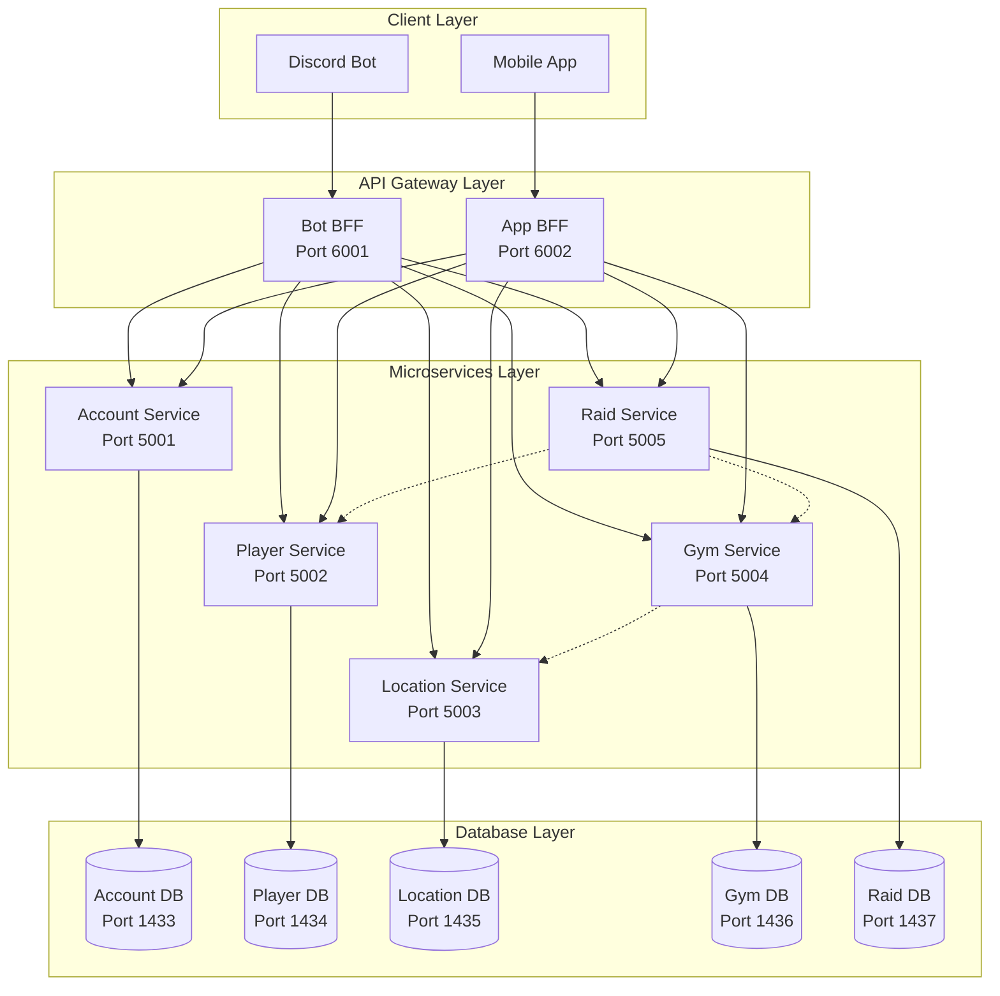
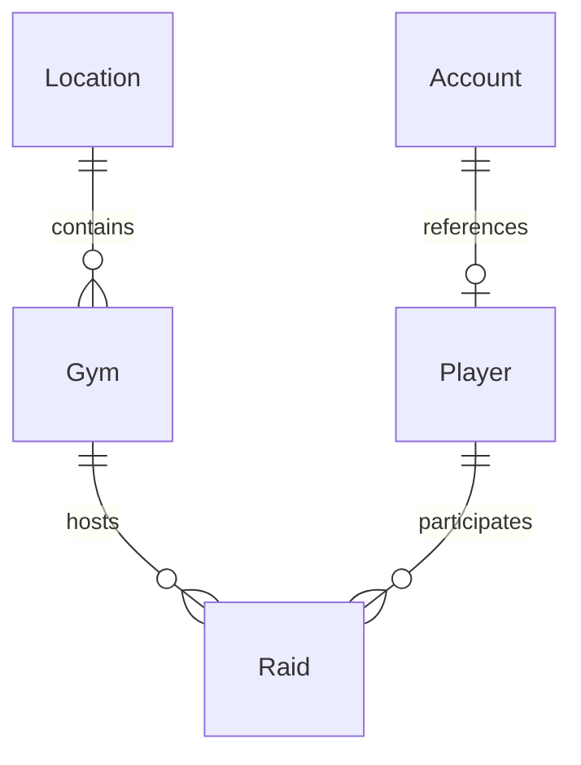

# 🏗️ POGO Community - Microservices Architecture

## Overview

The POGO Community platform has been architected as a modern microservices system using .NET 10, following Domain-Driven Design (DDD) principles and Clean Architecture patterns.

## 🎯 Architecture Principles

### 1. **Domain-Driven Design (DDD)**

- Each microservice represents a bounded context
- Clear domain boundaries and responsibilities
- Rich domain models with business logic

### 2. **Clean Architecture**

- **Domain Layer** - Core business entities and rules
- **Application Layer** - Use cases and application logic (CQRS)
- **Infrastructure Layer** - Data access and external services
- **API Layer** - Controllers and endpoints

### 3. **Database Per Service**

- Each microservice owns its data
- No shared databases between services
- Data consistency through eventual consistency

### 4. **API Gateway Pattern**

- Backend for Frontend (BFF) services
- Single entry point for client applications
- Request routing and aggregation

## 🏛️ System Architecture

## 🔧 Service Details

### Account Service

**Responsibility:** User authentication and account management

**Domain Entities:**

- `Account` - User account with email and password
- `Player` - Reference to player profile

**Key Features:**

- JWT token generation and validation
- Password hashing with BCrypt
- Account creation and login
- Email-based authentication

**Database:** `AccountDb` (SQL Server)

### Player Service

**Responsibility:** Player profiles and management

**Domain Entities:**

- `Player` - Player profile with username, level, team

**Key Features:**

- Player registration and updates
- Team assignments (Valor, Mystic, Instinct)
- Friend code management
- Discord integration

**Database:** `PlayerDb` (SQL Server)

### Location Service

**Responsibility:** Geographical locations and POIs

**Domain Entities:**

- `Location` - Geographical location with coordinates

**Key Features:**

- Location creation and management
- Spatial search with radius queries
- Address management and geocoding
- Location type classification

**Database:** `LocationDb` (SQL Server)

### Gym Service

**Responsibility:** Pokemon Gym management

**Domain Entities:**

- `Gym` - Pokemon Gym with team control

**Key Features:**

- Gym creation and management
- Team control tracking
- Motivation level monitoring
- Integration with Location service

**Dependencies:**

- Location Service (for location validation)

**Database:** `GymDb` (SQL Server)

### Raid Service

**Responsibility:** Pokemon Raid management

**Domain Entities:**

- `Raid` - Pokemon Raid with participants

**Key Features:**

- Raid creation and scheduling
- Player participation management
- Raid status tracking
- Integration with Gym and Player services

**Dependencies:**

- Gym Service (for gym validation)
- Player Service (for participant validation)

**Database:** `RaidDb` (SQL Server)

## 🌐 API Gateway (BFF)

### Bot BFF

**Purpose:** API Gateway for Discord bot communication

**Features:**

- Ocelot routing and load balancing
- Request aggregation
- CORS configuration for bot frontend
- Health check endpoints

**Routes:**

- `/api/account/*` → Account Service
- `/api/player/*` → Player Service
- `/api/location/*` → Location Service
- `/api/gym/*` → Gym Service
- `/api/raid/*` → Raid Service

### App BFF

**Purpose:** API Gateway for mobile app communication

**Features:**

- Ocelot routing and load balancing
- Request aggregation
- CORS configuration for mobile app
- Health check endpoints

**Routes:**

- `/api/account/*` → Account Service
- `/api/player/*` → Player Service
- `/api/location/*` → Location Service
- `/api/gym/*` → Gym Service
- `/api/raid/*` → Raid Service

## 🗄️ Data Architecture

### Database Per Service Pattern

Each microservice has its own dedicated database:

- **Account Service** → `AccountDb`
- **Player Service** → `PlayerDb`
- **Location Service** → `LocationDb`
- **Gym Service** → `GymDb`
- **Raid Service** → `RaidDb`

### Data Consistency

- **Strong Consistency** within each service
- **Eventual Consistency** between services
- **Saga Pattern** for distributed transactions
- **Event Sourcing** for audit trails

### Entity Relationships

## 🔄 Communication Patterns

### 1. **Synchronous Communication**

- HTTP/REST APIs between services
- Direct service-to-service calls
- Request/Response pattern

### 2. **Asynchronous Communication**

- Domain events for loose coupling
- Event-driven architecture
- Eventual consistency

### 3. **API Gateway Pattern**

- Single entry point for clients
- Request routing and load balancing
- Cross-cutting concerns (auth, logging, monitoring)

## 🛡️ Security Architecture

### Authentication

- **JWT Tokens** for stateless authentication
- **BCrypt** for password hashing
- **Token-based** API access

### Authorization

- **Role-based** access control
- **Service-level** permissions
- **API Gateway** security policies

### Network Security

- **Docker networks** for service isolation
- **Internal communication** only
- **External access** through API Gateway

## 📊 Monitoring and Observability

### Health Checks

- **Service-level** health endpoints
- **Database connectivity** checks
- **Dependency** health monitoring

### Logging

- **Structured logging** with Serilog
- **Centralized logging** aggregation
- **Request/Response** tracing

### Metrics

- **Performance metrics** per service
- **Database performance** monitoring
- **API Gateway** metrics

## 🚀 Deployment Architecture

### Containerization

- **Docker containers** for all services
- **Multi-stage builds** for optimization
- **Health checks** in containers

### Orchestration

- **Docker Compose** for local development
- **Service discovery** through container names
- **Load balancing** through API Gateway

### Scaling

- **Horizontal scaling** per service
- **Independent scaling** based on load
- **Database scaling** per service

## 🔧 Development Workflow

### Local Development

1. **Start databases** with Docker Compose
2. **Run microservices** locally or in containers
3. **Use API Gateway** for client communication
4. **Debug** individual services independently

### Testing Strategy

- **Unit tests** for domain logic
- **Integration tests** for API endpoints
- **End-to-end tests** through API Gateway
- **Contract tests** between services

### CI/CD Pipeline

- **Build** all services independently
- **Test** each service in isolation
- **Deploy** services independently
- **Monitor** service health and performance

## 📈 Performance Considerations

### Caching

- **In-memory caching** for frequently accessed data
- **Redis** for distributed caching
- **CDN** for static content

### Database Optimization

- **Proper indexing** for query performance
- **Connection pooling** for database connections
- **Read replicas** for read-heavy workloads

### API Gateway

- **Request aggregation** to reduce round trips
- **Response caching** for static data
- **Load balancing** across service instances

## 🔮 Future Enhancements

### Event-Driven Architecture

- **Event Sourcing** for audit trails
- **CQRS** for read/write separation
- **Event streaming** with Apache Kafka

### Service Mesh

- **Istio** for service-to-service communication
- **Circuit breakers** for fault tolerance
- **Distributed tracing** for observability

### Cloud Native

- **Kubernetes** for container orchestration
- **Service mesh** for communication
- **Cloud databases** for scalability

---

This architecture provides a solid foundation for a scalable, maintainable, and reliable Pokemon GO community platform! 🎮✨
