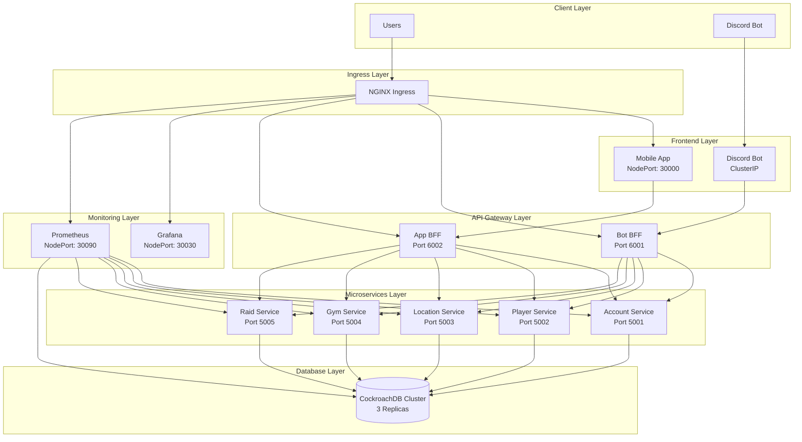

# 🚀 POGO Community - Kubernetes Deployment Guide

## Overview

This guide covers deploying the POGO Community platform to Kubernetes using Minikube. The platform has been migrated from Docker Compose to a full Kubernetes deployment with monitoring, persistent storage, and production-ready configurations.

## 🏗️ Architecture

### Kubernetes Components



## 📋 Prerequisites

### Required Software

- **Minikube** - Local Kubernetes cluster
- **kubectl** - Kubernetes command-line tool
- **Docker** - Container runtime
- **Git** - Version control

### Installation

#### macOS (using Homebrew)
```bash
# Install Minikube
brew install minikube

# Install kubectl
brew install kubectl

# Install Docker Desktop
brew install --cask docker
```

#### Linux
```bash
# Install Minikube
curl -LO https://storage.googleapis.com/minikube/releases/latest/minikube-linux-amd64
sudo install minikube-linux-amd64 /usr/local/bin/minikube

# Install kubectl
curl -LO "https://dl.k8s.io/release/$(curl -L -s https://dl.k8s.io/release/stable.txt)/bin/linux/amd64/kubectl"
sudo install -o root -g root -m 0755 kubectl /usr/local/bin/kubectl
```

### Verify Installation
```bash
minikube version
kubectl version --client
docker --version
```

## 🚀 Quick Start

### 1. Start Minikube
```bash
# Start Minikube with sufficient resources
minikube start --memory=4096 --cpus=2

# Verify cluster is running
minikube status
```

### 2. Build and Deploy
```bash
# Build all Docker images and load into Minikube
make k8s-build

# Deploy entire platform to Kubernetes
make k8s-deploy
```

### 3. Access Applications
```bash
# Get Minikube IP
minikube ip

# Access applications
# Mobile App: http://<minikube-ip>:30000
# Grafana: http://<minikube-ip>:30030
# Prometheus: http://<minikube-ip>:30090
```

## 📁 Directory Structure

```
k8s/
├── base/                    # Base Kubernetes resources
│   ├── namespace.yaml       # Namespace definition
│   └── ingress.yaml         # Ingress configuration
├── config/                  # Configuration files
│   ├── common-config.yaml   # Common environment variables
│   ├── service-urls-config.yaml  # Service URLs
│   ├── db-secrets.yaml      # Database secrets
│   ├── jwt-secrets.yaml     # JWT secrets
│   ├── discord-secrets.yaml # Discord bot secrets
│   └── google-cloud-secrets.yaml # Google Cloud secrets
├── databases/               # Database deployments
│   ├── cockroachdb-statefulset.yaml
│   ├── cockroachdb-service.yaml
│   └── cockroachdb-init-job.yaml
├── microservices/           # Microservice deployments
│   ├── account-service-deployment.yaml
│   ├── account-service-service.yaml
│   ├── player-service-deployment.yaml
│   ├── player-service-service.yaml
│   ├── location-service-deployment.yaml
│   ├── location-service-service.yaml
│   ├── gym-service-deployment.yaml
│   ├── gym-service-service.yaml
│   ├── raid-service-deployment.yaml
│   └── raid-service-service.yaml
├── bffs/                    # BFF deployments
│   ├── bot-bff-deployment.yaml
│   ├── bot-bff-service.yaml
│   ├── app-bff-deployment.yaml
│   └── app-bff-service.yaml
├── apps/                    # Frontend app deployments
│   ├── bot-deployment.yaml
│   ├── bot-service.yaml
│   ├── app-deployment.yaml
│   └── app-service.yaml
├── monitoring/              # Monitoring stack
│   ├── prometheus-configmap.yaml
│   ├── prometheus-rbac.yaml
│   ├── prometheus-deployment.yaml
│   ├── prometheus-service.yaml
│   ├── grafana-configmap.yaml
│   ├── grafana-dashboards-configmap.yaml
│   ├── grafana-deployment.yaml
│   └── grafana-service.yaml
├── build-images.sh          # Image build script
├── deploy.sh               # Deployment script
└── teardown.sh             # Teardown script
```

## 🔧 Configuration

### Environment Variables

All configuration is managed through Kubernetes ConfigMaps and Secrets:

#### Common Configuration (`common-config.yaml`)
- `ASPNETCORE_ENVIRONMENT`: Production
- `NODE_ENV`: production
- `DB_HOST`: cockroachdb-public
- `DB_PORT`: 26257
- `DB_SSL_MODE`: disable

#### Service URLs (`service-urls-config.yaml`)
- Microservice internal URLs
- BFF URLs
- Inter-service communication URLs

#### Secrets
- **Database**: CockroachDB credentials
- **JWT**: Token signing keys
- **Discord**: Bot token
- **Google Cloud**: Project credentials

### Database Configuration

CockroachDB is deployed as a 3-replica StatefulSet with:
- **Storage**: 5Gi per replica (15Gi total)
- **Memory**: 1Gi per replica
- **CPU**: 500m per replica
- **Persistence**: PersistentVolumeClaims

Connection string format:
```
Host=cockroachdb-public;Port=26257;Database={DbName};Username=root;SslMode=Disable
```

## 📊 Monitoring

### Prometheus
- **URL**: `http://<minikube-ip>:30090`
- **Scrapes**: All microservices, CockroachDB, Kubernetes metrics
- **Retention**: 15 days (configurable)

### Grafana
- **URL**: `http://<minikube-ip>:30030`
- **Username**: admin
- **Password**: admin
- **Dashboards**: Pre-configured for microservices and CockroachDB

### Metrics Endpoints
All microservices expose Prometheus metrics at `/metrics`:
- HTTP request metrics
- Database connection metrics
- Custom business metrics

## 🛠️ Management Commands

### Using Makefile
```bash
# Show all available commands
make k8s

# Build and load images
make k8s-build

# Deploy platform
make k8s-deploy

# Check status
make k8s-status

# View logs
make k8s-logs

# Open shell in pod
make k8s-shell POD=account-service-xxx

# Teardown platform
make k8s-teardown
```

### Using kubectl
```bash
# Check pod status
kubectl get pods -n pogo-system

# Check services
kubectl get services -n pogo-system

# View logs
kubectl logs -f deployment/account-service -n pogo-system

# Port forward for debugging
kubectl port-forward service/account-service 5001:5001 -n pogo-system
```

## 🔍 Troubleshooting

### Common Issues

#### 1. Pods Not Starting
```bash
# Check pod status
kubectl get pods -n pogo-system

# Describe pod for details
kubectl describe pod <pod-name> -n pogo-system

# Check logs
kubectl logs <pod-name> -n pogo-system
```

#### 2. Database Connection Issues
```bash
# Check CockroachDB status
kubectl get pods -l app=cockroachdb -n pogo-system

# Check database logs
kubectl logs -l app=cockroachdb -n pogo-system

# Connect to database
kubectl exec -it cockroachdb-0 -n pogo-system -- /cockroach/cockroach sql --insecure
```

#### 3. Service Discovery Issues
```bash
# Check service endpoints
kubectl get endpoints -n pogo-system

# Test service connectivity
kubectl run test-pod --image=busybox -it --rm -- nslookup account-service.pogo-system.svc.cluster.local
```

#### 4. Image Pull Issues
```bash
# Check if images are loaded
eval $(minikube docker-env)
docker images | grep pogo

# Rebuild and load images
make k8s-build
```

### Debugging Commands

```bash
# Get all resources
kubectl get all -n pogo-system

# Check events
kubectl get events -n pogo-system --sort-by='.lastTimestamp'

# Check resource usage
kubectl top pods -n pogo-system
kubectl top nodes

# Check persistent volumes
kubectl get pv,pvc -n pogo-system
```

## 🔄 Scaling

### Horizontal Pod Autoscaling
```yaml
apiVersion: autoscaling/v2
kind: HorizontalPodAutoscaler
metadata:
  name: account-service-hpa
  namespace: pogo-system
spec:
  scaleTargetRef:
    apiVersion: apps/v1
    kind: Deployment
    name: account-service
  minReplicas: 2
  maxReplicas: 10
  metrics:
  - type: Resource
    resource:
      name: cpu
      target:
        type: Utilization
        averageUtilization: 70
```

### Manual Scaling
```bash
# Scale microservice
kubectl scale deployment account-service --replicas=5 -n pogo-system

# Scale BFF
kubectl scale deployment bot-bff --replicas=3 -n pogo-system
```

## 🔒 Security

### Network Policies
```yaml
apiVersion: networking.k8s.io/v1
kind: NetworkPolicy
metadata:
  name: microservices-netpol
  namespace: pogo-system
spec:
  podSelector:
    matchLabels:
      tier: microservice
  policyTypes:
  - Ingress
  - Egress
  ingress:
  - from:
    - podSelector:
        matchLabels:
          tier: gateway
  egress:
  - to:
    - podSelector:
        matchLabels:
          app: cockroachdb
```

### Resource Limits
All containers have resource requests and limits:
- **CPU**: 250m request, 500m limit
- **Memory**: 256Mi request, 512Mi limit

### Secrets Management
- All secrets are stored in Kubernetes Secrets
- No hardcoded credentials in manifests
- Secrets are mounted as environment variables

## 📈 Performance Optimization

### Resource Tuning
```yaml
resources:
  requests:
    cpu: 500m
    memory: 1Gi
  limits:
    cpu: 1000m
    memory: 2Gi
```

### Database Optimization
- CockroachDB cluster with 3 replicas
- Persistent volumes for data durability
- Connection pooling in applications

### Monitoring Optimization
- Prometheus with 15s scrape intervals
- Grafana with pre-configured dashboards
- Alert rules for critical metrics

## 🚀 Production Considerations

### Before Production
1. **Replace secrets** with proper values
2. **Configure ingress** with proper TLS certificates
3. **Set up persistent storage** with appropriate storage classes
4. **Configure resource quotas** and limits
5. **Set up monitoring** and alerting
6. **Configure backup** strategies for CockroachDB

### Production Deployment
1. Use a proper container registry (Docker Hub, ECR, GCR)
2. Implement proper CI/CD pipelines
3. Use Helm charts for deployment management
4. Configure proper logging aggregation
5. Set up backup and disaster recovery

## 📚 Additional Resources

- [Kubernetes Documentation](https://kubernetes.io/docs/)
- [Minikube Documentation](https://minikube.sigs.k8s.io/docs/)
- [CockroachDB on Kubernetes](https://www.cockroachlabs.com/docs/stable/orchestrate-cockroachdb-with-kubernetes.html)
- [Prometheus Operator](https://github.com/prometheus-operator/prometheus-operator)
- [Grafana Kubernetes](https://grafana.com/docs/grafana/latest/setup-grafana/installation/kubernetes/)

---

This completes the Kubernetes deployment guide for the POGO Community platform! 🎉
