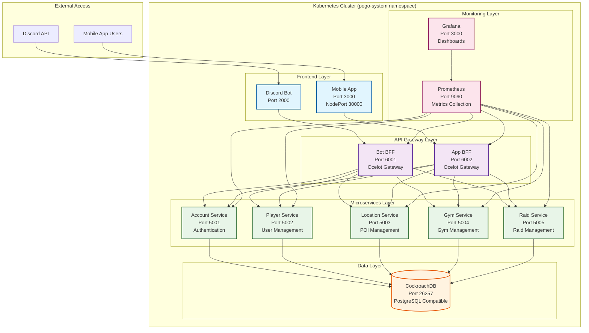

# POGO Community - Kubernetes Deployment Guide

This guide provides comprehensive documentation for deploying and managing the POGO Community platform on Kubernetes using Minikube.

## 📋 Table of Contents

- [Prerequisites](#prerequisites)
- [Architecture Overview](#architecture-overview)
- [Quick Start](#quick-start)
- [Detailed Deployment](#detailed-deployment)
- [Service Management](#service-management)
- [Monitoring & Observability](#monitoring--observability)
- [Troubleshooting](#troubleshooting)
- [Production Considerations](#production-considerations)

## Prerequisites

### Required Software

- **Minikube** v1.37.0+ - Local Kubernetes cluster
- **kubectl** v1.28+ - Kubernetes command-line tool
- **Docker** v24+ - Container runtime
- **Make** - Build automation tool

### System Requirements

- **Memory**: Minimum 8GB RAM (16GB recommended)
- **CPU**: Minimum 4 cores (8 cores recommended)
- **Storage**: Minimum 20GB free disk space
- **OS**: macOS, Linux, or Windows with WSL2

### Verify Installation

```bash
# Check Minikube version
minikube version

# Check kubectl version
kubectl version --client

# Check Docker version
docker --version

# Check Make version
make --version
```

## Architecture Overview

### System Architecture



### Component Overview

| Component                 | Type        | Purpose                | Port  | External Access                |
| ------------------------- | ----------- | ---------------------- | ----- | ------------------------------ |
| **Frontend Applications** |
| Discord Bot               | Deployment  | Discord integration    | 2000  | Port Forward                   |
| Mobile App                | Deployment  | React Native web app   | 3000  | NodePort 30000                 |
| **API Gateways**          |
| Bot BFF                   | Deployment  | Bot API gateway        | 6001  | Port Forward                   |
| App BFF                   | Deployment  | App API gateway        | 6002  | Port Forward                   |
| Swagger Gateway           | Deployment  | API documentation      | 10000 | Port Forward (localhost:10000) |
| **Microservices**         |
| Account Service           | Deployment  | Authentication & users | 5001  | Internal                       |
| Player Service            | Deployment  | Player management      | 5002  | Internal                       |
| Location Service          | Deployment  | POI management         | 5003  | Internal                       |
| Gym Service               | Deployment  | Gym management         | 5004  | Internal                       |
| Raid Service              | Deployment  | Raid management        | 5005  | Internal                       |
| **Database**              |
| CockroachDB               | StatefulSet | PostgreSQL database    | 26257 | Internal                       |
| **Monitoring**            |
| Prometheus                | Deployment  | Metrics collection     | 9090  | Port Forward (localhost:10002) |
| Grafana                   | Deployment  | Monitoring dashboards  | 3000  | Port Forward (localhost:10001) |

## Quick Start

### 1. Start Minikube

```bash
# Start Minikube with sufficient resources
minikube start --memory=8192 --cpus=4

# Enable required addons
minikube addons enable ingress
minikube addons enable metrics-server

# Verify Minikube is running
minikube status
```

### 2. Build and Deploy

```bash
# Build all Docker images and load into Minikube
make k8s-build

# Deploy all services to Kubernetes
make k8s-deploy

# Validate deployment
make k8s-validate
```

### 3. Access Applications

```bash
# Get Minikube IP
MINIKUBE_IP=$(minikube ip)
echo "Minikube IP: $MINIKUBE_IP"

# Access applications (port forwarding is automatic)
echo "Mobile App:      http://$MINIKUBE_IP:30000"
echo "Swagger Gateway: http://localhost:10000"
echo "Grafana:         http://localhost:10001"
echo "Prometheus:      http://localhost:10002"
```

**Note**: Port forwarding for monitoring services (Swagger Gateway, Grafana, Prometheus) starts automatically after deployment. If port forwarding fails, you can access Grafana and Prometheus via NodePort using the Minikube IP.

## Detailed Deployment

## Secret Management

### Creating Secrets

Before deploying the application, you must create the required Kubernetes secrets. The POGO Community project includes a secure secret generation script.

#### Quick Secret Creation

```bash
# Interactive mode (prompts for all values)
./k8s/create-secrets.sh

# Auto-generate mode (generates JWT & DB secrets, prompts for Discord)
./k8s/create-secrets.sh --auto

# From environment variables
export DISCORD_BOT_TOKEN="your_token"
export JWT_SECRET_KEY="your_secret"
./k8s/create-secrets.sh --from-env
```

#### Required Secrets

| Secret Name       | Purpose                    | Required Keys                                                        |
| ----------------- | -------------------------- | -------------------------------------------------------------------- |
| `discord-secrets` | Discord bot authentication | `DISCORD_BOT_TOKEN`                                                  |
| `jwt-secrets`     | JWT token signing          | `JWT_SECRET_KEY`, `JWT_ISSUER`, `JWT_AUDIENCE`, `JWT_EXPIRY_MINUTES` |
| `db-secrets`      | Database credentials       | `DB_USERNAME`, `DB_PASSWORD`, `MSSQL_SA_PASSWORD`                    |

#### Secret Creation Options

**Interactive Mode:**

- Prompts for each secret value
- Provides clear instructions for obtaining values
- Validates input format and length
- Never echoes secrets to terminal

**Auto-Generate Mode:**

- Generates secure random values for JWT secret and DB password
- Uses `openssl rand -base64 32` for JWT secret
- Uses `openssl rand -base64 24` for DB password
- Still requires manual input for Discord token

**Environment Variable Mode:**

- Reads secrets from environment variables
- Useful for CI/CD pipelines
- Can use `.env` file or exported variables

#### Secret Management Commands

```bash
# Create all secrets interactively
./k8s/create-secrets.sh

# Update specific secret
./k8s/create-secrets.sh --update discord-secrets

# Dry run (preview changes)
./k8s/create-secrets.sh --dry-run

# Check existing secrets
kubectl get secrets -n pogo-system

# View secret (base64 encoded)
kubectl get secret discord-secrets -n pogo-system -o yaml

# Delete secret
kubectl delete secret discord-secrets -n pogo-system
```

#### Security Best Practices

- **Never commit secrets to git**
- **Use strong, randomly generated passwords**
- **Rotate secrets regularly**
- **Use Kubernetes RBAC to limit secret access**
- **Consider using external secret management (e.g., HashiCorp Vault)**

#### Getting Discord Bot Token

1. Go to [Discord Developer Portal](https://discord.com/developers/applications)
2. Select your application
3. Navigate to **Bot** section
4. Click **Reset Token**
5. Copy the token (starts with `MTA...`)

#### Generating JWT Secret

```bash
# Generate a secure JWT secret
openssl rand -base64 32

# Or use the script's auto-generation
./k8s/create-secrets.sh --auto
```

### Step-by-Step Deployment

#### 1. Environment Setup

```bash
# Clone repository
git clone <repository-url>
cd pogo

# Verify prerequisites
make k8s  # Shows available commands and prerequisites
```

#### 2. Build Images

```bash
# Build all Docker images
make k8s-build

# Verify images are loaded
eval $(minikube docker-env)
docker images | grep pogo
```

#### 3. Create Secrets

```bash
# Create all required secrets
./k8s/create-secrets.sh --auto

# Verify secrets were created
kubectl get secrets -n pogo-system
```

#### 4. Deploy Services

```bash
# Deploy all services
make k8s-deploy

# Monitor deployment progress
kubectl get pods -n pogo-system -w
```

#### 5. Verify Deployment

```bash
# Check all components
make k8s-validate

# Check specific services
kubectl get pods -n pogo-system
kubectl get services -n pogo-system
kubectl get ingress -n pogo-system
```

### Manual Deployment Steps

If you prefer manual deployment:

```bash
# 1. Create namespace
kubectl apply -f k8s/base/namespace.yaml

# 2. Create secrets
./k8s/create-secrets.sh --auto

# 3. Deploy database
kubectl apply -f k8s/databases/

# 4. Wait for database to be ready
kubectl wait --for=condition=ready pod -l app=cockroachdb -n pogo-system --timeout=300s

# 5. Deploy microservices
kubectl apply -f k8s/microservices/

# 6. Deploy BFFs
kubectl apply -f k8s/bffs/

# 7. Deploy frontend apps
kubectl apply -f k8s/apps/

# 8. Deploy monitoring
kubectl apply -f k8s/monitoring/

# 9. Deploy ingress
kubectl apply -f k8s/base/ingress.yaml
```

## Service Management

### Available Commands

```bash
# Build and Deploy
make k8s-build          # Build all Docker images
make k8s-deploy         # Deploy to Kubernetes
make k8s-teardown       # Remove all resources

# Monitoring
make k8s-status         # Show pod status
make k8s-logs           # View logs
make k8s-validate       # Validate deployment

# Port Forwarding
make k8s-port-forward-start   # Start port forwarding for monitoring services
make k8s-port-forward-stop    # Stop port forwarding
make k8s-port-forward-status  # Show port forwarding status

# Debugging
make k8s-shell POD=<pod-name>  # Open shell in pod
```

### Automatic Port Forwarding

Port forwarding for monitoring services (Swagger Gateway, Grafana, Prometheus) starts automatically after deployment. The system uses the following local port mappings:

- **Swagger Gateway**: `localhost:10000` → `service:10000`
- **Grafana**: `localhost:10001` → `service:3000`
- **Prometheus**: `localhost:10002` → `service:9090`

#### Manual Port Forwarding Management

```bash
# Start port forwarding manually
make k8s-port-forward-start
# or
./k8s/port-forward.sh start

# Stop port forwarding
make k8s-port-forward-stop
# or
./k8s/port-forward.sh stop

# Check status
make k8s-port-forward-status
# or
./k8s/port-forward.sh status

# Restart port forwarding
./k8s/port-forward.sh restart
```

#### Port Forwarding Features

- **Background Process**: Port forwarding runs in the background and persists across terminal sessions
- **Health Checks**: Verifies services are ready before starting port forwarding
- **Process Management**: Uses PID files to track and manage background processes
- **Automatic Cleanup**: Port forwarding is automatically stopped during teardown
- **Status Monitoring**: Easy status checking and troubleshooting

### Service Status

```bash
# Check all pods
kubectl get pods -n pogo-system

# Check specific service
kubectl get pods -l app=account-service -n pogo-system

# Check service endpoints
kubectl get endpoints -n pogo-system

# Check persistent volumes
kubectl get pvc -n pogo-system
```

### Scaling Services

```bash
# Scale microservice
kubectl scale deployment account-service --replicas=3 -n pogo-system

# Scale BFF
kubectl scale deployment bot-bff --replicas=2 -n pogo-system

# Check scaling status
kubectl get pods -l app=account-service -n pogo-system
```

### Rolling Updates

```bash
# Update deployment
kubectl set image deployment/account-service account-service=pogo/account-service:v2.0 -n pogo-system

# Check rollout status
kubectl rollout status deployment/account-service -n pogo-system

# Rollback if needed
kubectl rollout undo deployment/account-service -n pogo-system
```

## Monitoring & Observability

### Health Checks

All services include comprehensive health checks:

- **Readiness Probe**: `/health/ready` - Service is ready to accept traffic
- **Liveness Probe**: `/health/live` - Service is running and healthy
- **Custom Health Checks**: Database connectivity and external service checks

### Prometheus Metrics

```bash
# Access Prometheus (automatic port forwarding)
open http://localhost:10002

# Or manually start port forwarding
kubectl port-forward service/prometheus 10002:9090 -n pogo-system

# Query metrics
curl http://localhost:10002/api/v1/query?query=up
```

### Grafana Dashboards

```bash
# Access Grafana (automatic port forwarding)
open http://localhost:10001

# Or manually start port forwarding
kubectl port-forward service/grafana 10001:3000 -n pogo-system

# Login credentials
# Username: admin
# Password: admin
```

### Log Management

```bash
# View all logs
make k8s-logs

# View specific service logs
kubectl logs -l app=account-service -n pogo-system --tail=100

# Follow logs in real-time
kubectl logs -l app=account-service -n pogo-system -f
```

## Troubleshooting

### Common Issues

#### 1. Pods Not Starting

```bash
# Check pod status
kubectl get pods -n pogo-system

# Check pod events
kubectl describe pod <pod-name> -n pogo-system

# Check pod logs
kubectl logs <pod-name> -n pogo-system
```

#### 2. Database Connection Issues

```bash
# Check CockroachDB status
kubectl get pods -l app=cockroachdb -n pogo-system

# Check database logs
kubectl logs -l app=cockroachdb -n pogo-system

# Test database connectivity
kubectl exec -it cockroachdb-0 -n pogo-system -- cockroach sql --insecure
```

#### 3. Service Discovery Issues

```bash
# Check service endpoints
kubectl get endpoints -n pogo-system

# Test DNS resolution
kubectl run test-pod --image=busybox --rm -it --restart=Never -- nslookup account-service.pogo-system.svc.cluster.local

# Check service connectivity
kubectl run test-pod --image=curlimages/curl --rm -it --restart=Never -- curl http://account-service.pogo-system.svc.cluster.local:5001/health/ready
```

#### 4. Resource Constraints

```bash
# Check resource usage
kubectl top pods -n pogo-system
kubectl top nodes

# Check resource limits
kubectl describe pod <pod-name> -n pogo-system | grep -A 5 "Limits:"
```

#### 5. Port Forwarding Issues

```bash
# Check port forwarding status
make k8s-port-forward-status

# Check if services are ready
kubectl get services -n pogo-system
kubectl get endpoints -n pogo-system

# Restart port forwarding
make k8s-port-forward-stop
make k8s-port-forward-start

# Check for port conflicts
lsof -i :10000  # Swagger Gateway
lsof -i :10001  # Grafana
lsof -i :10002  # Prometheus

# Manual port forwarding test
kubectl port-forward service/prometheus 10002:9090 -n pogo-system
```

### Debugging Commands

```bash
# Get detailed pod information
kubectl describe pod <pod-name> -n pogo-system

# Check service configuration
kubectl describe service <service-name> -n pogo-system

# Check ingress configuration
kubectl describe ingress pogo-ingress -n pogo-system

# Check persistent volume claims
kubectl describe pvc <pvc-name> -n pogo-system
```

### Log Analysis

```bash
# Search for errors
kubectl logs -l app=account-service -n pogo-system | grep -i error

# Search for specific patterns
kubectl logs -l app=account-service -n pogo-system | grep "connection"

# Get logs from all containers
kubectl logs -l app=account-service -n pogo-system --all-containers=true
```

## Production Considerations

### Security

- **Secrets Management**: Use Kubernetes secrets for sensitive data
- **Network Policies**: Implement network policies for service isolation
- **RBAC**: Configure role-based access control
- **Image Security**: Use trusted base images and scan for vulnerabilities

### Performance

- **Resource Limits**: Set appropriate CPU and memory limits
- **Horizontal Pod Autoscaling**: Implement HPA for automatic scaling
- **Database Optimization**: Configure CockroachDB for production workloads
- **Caching**: Implement Redis for caching frequently accessed data

### High Availability

- **Multi-Node Cluster**: Deploy on multiple nodes
- **Database Replication**: Configure CockroachDB with multiple replicas
- **Load Balancing**: Use proper load balancing strategies
- **Backup Strategy**: Implement regular database backups

### Monitoring

- **Alerting**: Configure Prometheus alerts for critical metrics
- **Log Aggregation**: Use centralized logging solution
- **Distributed Tracing**: Implement tracing for microservices
- **Performance Monitoring**: Monitor application performance metrics

### Backup and Recovery

```bash
# Backup CockroachDB
kubectl exec -it cockroachdb-0 -n pogo-system -- cockroach dump --insecure --database=pogo_account > account_backup.sql

# Restore from backup
kubectl exec -i cockroachdb-0 -n pogo-system -- cockroach sql --insecure < account_backup.sql
```

## Additional Resources

- [Kubernetes Documentation](https://kubernetes.io/docs/)
- [Minikube Documentation](https://minikube.sigs.k8s.io/docs/)
- [CockroachDB Kubernetes Guide](https://www.cockroachlabs.com/docs/stable/orchestrate-cockroachdb-with-kubernetes.html)
- [Prometheus Kubernetes Integration](https://prometheus.io/docs/prometheus/latest/configuration/configuration/)
- [Grafana Kubernetes Dashboards](https://grafana.com/docs/grafana/latest/datasources/prometheus/)

---

For more information, see the main [README.md](../README.md) or contact the development team.
